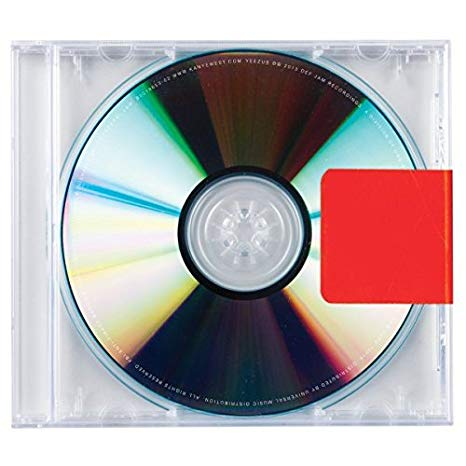

I was on my first roadtrip with friends from college, and as driver, I asked my passengers what album they wanted me to start with. This was the first instance of my life when I realized most people pick and choose a few songs, and skip over the rest. 

> Fox, you fuckin' dork. Here, check out this mix by "B1TCHE5_AND_$$$$"

This isn't to knock the clout game, as I'm a (albiet poor) participant in the loudness war on soundcloud. One day I'll write a post about how saturators are designed to blow out speakers, but we'll cross that bridge when we come to it. 

However, I'm grateful to have had friends that were even bigger music dorks than I, and we would share new sounds consistently. Here, I'll pay homage to the albums that danced through the best and worst of my memories. 

## Cage The Elephant - Cage The Elephant

A neat video game called Borderlands was released in 2009, and as a true 7th grader, I fully intended on spending my entire summer playing this with my friends. Due to parental scrutiny, I wasn't given the go-ahead for an "M" rated game, but got to try it at a friends house instead. The opening chords on "Ain't No Rest For the Wicked" were enough to turn my head. After searching youtube, I stumbled upon this gem of an album. 

Since my Dad drove a truck, most of my youth was spent listening to "real music" like AC/DC, Led Zeppelin, Rush, and other big rock bands from the 80s. Cage The Elephant was the first modern act I had heard with the same sonic ferocity of the hair metal scene, and Matt Shultz voice harmonizes along the grooving basslines and slick guitar melodies. 

<!-- ## Kendrick Lamar - good kid, M.A.A.D CITY

## The Silent Comedy - Common Faults

## Kanye West - The College Dropout

## Death Grips - Ex-Military

## Portugal. the Man - Evil Friends

## Chance the Rapper - Acid Rap -->

<!-- ## Kanye West - Yeezus

I've gotten in yelling matches with people about Yeezus. I'll defend this work of pure art until it's found permanent rest in a Federal museum.

## Glass Animals - ZABA

## KIDS SEE GHOSTS - KIDS SEE GHOSTS -->
---
_This is a working document, as music is constantly changing our lives. We'll see where it goes._

_-Fox_
