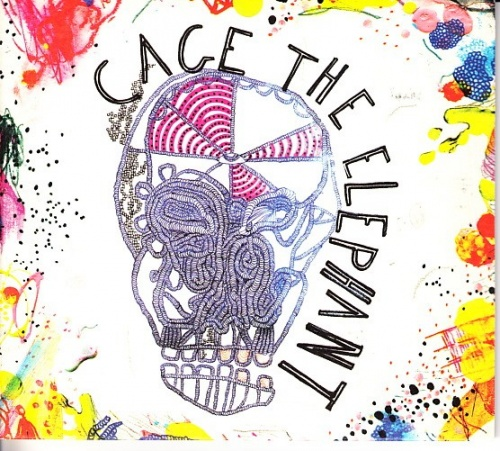
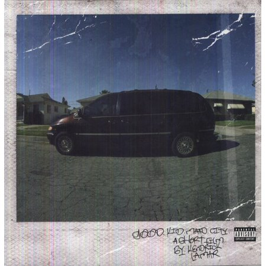
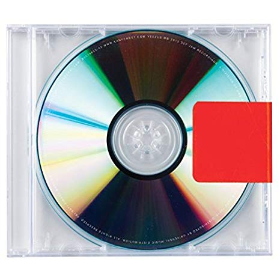

I was on my first roadtrip with friends from college, and as driver, I asked my passengers what album they wanted me to start with. This was the first instance of my life when I realized most people pick and choose a few songs, and skip over the rest. 

> Fox, you fuckin' dork. Here, check out this mix by "B1TCHE5\_N\_$$$$"

This isn't to knock the clout game, as I'm a (albiet poor) participant in the loudness war on soundcloud. One day I'll write a post about how saturators are designed to blow out speakers, but we'll cross that bridge when we come to it. 

However, I'm grateful to have had friends that were even bigger music dorks than I, and we would share new sounds consistently. Here, I'll pay homage to the albums that danced through the best and worst of my memories. 

## Cage The Elephant - Cage The Elephant

A neat video game called Borderlands was released in 2009, and as a true 7th grader, I fully intended on spending my entire summer playing this with my friends. Due to parental scrutiny, I wasn't given the go-ahead for an "M" rated game, but got to try it at a friends house instead. The opening chords on "Ain't No Rest For the Wicked" were enough to turn my head. After searching youtube, I stumbled upon this gem of an album. 

Since my Dad drove a truck, most of my youth was spent listening to "real rock" like AC/DC, Led Zeppelin, Rush, and other big rock bands from the 80s. Cage The Elephant was the first modern act I had heard with the same sonic ferocity of the hair metal scene, and Matt Shultz voice harmonizes along the grooving basslines and slick guitar melodies. 

#### Favorite Track
 - James Brown
  
#### Best 3 Song Stretch
 - Back Against The Wall
 - Drones in the Valley
 - Judas

## Kendrick Lamar - good kid, M.A.A.D CITY

Similar to how I only listened to "real rock," I look back and cringe on how I would only listen to "real hip-hop" like Hopsin or Eminem. Thankfully, we can look back on our cringey moments and know that we've grown as a person.

good kid, MAAD City was an album that expanded my understanding of what storytelling in music could be. Kendrick Lamar's brilliant use of over-arching literary themes, subtle irony between the soundscape and lyrics, and vocal control is impressive on each individual track.

However, the beauty of this album is how each track is enumerated in such precise order, and the attention to detail for story continuity is Oscar worthy. Not to mention it's about 50% bangers. 

#### Favorite Track 
- The Recipe 

#### Best 3 Song Stretch
- Backseat Freestyle
- The Art of Peer Pressure
- Money Trees

## Kanye West - Yeezus

I've gotten in yelling matches with people about Yeezus. I'll defend this work of pure art until it's found permanent rest in a Federal museum. 

However, the argument that Kanye peaked with _Twisted Fantasy_ is full of merit. From lyrical powerhouses of Gorgeous and Blame Game to the writer's block ridden struggles of Swaghili and French Restaurants, and it's readily apparent than we've come a long way from the days from KanyeToThe. While his creative ways to rhyme still don't rely around knives or guns, they're replaced with hyper sexual roars against any institution that dare stand in his way.

>Which is precisely why Yeezus is my favorite album by Kanye. 

Yeezus was the first Kanye album I listened to after being aware of his public life. He had just released arguably the best hiphop album ever. The paparrazi continues to pry for glimpses into the most minute details of his life. He's disrupting fashion collaborations with Louis Vuitton, Nike, and up-and-comer Virgil Abloh. His album 808s and Heartbreak is spawning a new generation of RnB rappers like Drake, and single handedly reviatalized the distorted 808 boom.

He also believes he's being shortchanged. He's not being given the tools he needs to create. Corporations are holding contracts over his head. He's frustrated at the state of the world, and is seeking stability amidst the madness. So, true to form, he rewrites the book on Hip Hop again. 

Yeezus opens with On Sight, a sonic whirlwind of LFO and Rick Ribin (TM) Distortion. Produced alongside Daft Punk, Kanye goes on to snarl "Yeezy season approaching, fuck whatever y'all been hearing." We bought the ticket, and here comes the ride. 

The experimental approach Kanye took involved growling synthesizers, obscure dog barking samples, viscous basslines, and raw lyricism. It's not an album you listen to for lyrical enjoyment, but to feel inspired to make something out of seemingly nothing. 

#### Favorite Track
- Hold My Liquor

#### Best 3 Song Stretch
- Black Skinhead
- I Am A God
- New Slaves

<!--
## The Silent Comedy - Common Faults

## Kanye West - The College Dropout

## Death Grips - Ex-Military

## Portugal. the Man - Evil Friends

## Chance the Rapper - Acid Rap 

## Glass Animals - ZABA

## KIDS SEE GHOSTS - KIDS SEE GHOSTS -->
---
_This is a working document, as music is constantly changing our lives. We'll see where it goes._

_-Fox_
