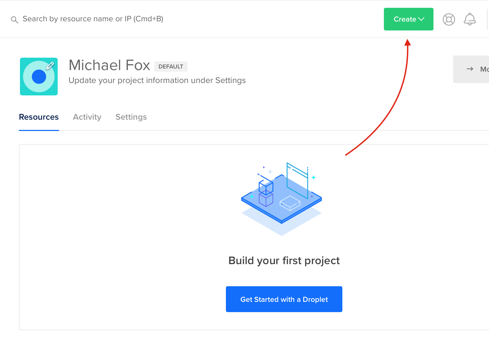
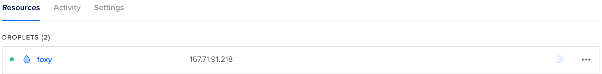

# A brief detour into Fintech
Typically, my relationship with programming is exclusive to Populus, my apparel crowdfunding side-hustle. While the powers of Full Stack JavaScript are easy to work with, I occasionally get the itch to experiment with other languages for one-off projects. 

Recently, I've been spending a good amount of time learning bash scripting as I continue to build DevOps processes for the Populus Web Client and RESTful API, and I've always wanted to try writing my own Python script. Since I don't have a fleet of overworked analysts running the hot numbers across my desk, making the computer pick up the slack is nice.


## What we're building
In this post, I'll do a walkthrough of how I setup a daily report for the S&P500 Index using Python, IEXCloud, and a Digital Ocean Ubuntu Droplet. 

Here's a flowchart of what the project does for the user. 

**We'll be creating an instance of Ubuntu on a DigitalOcean droplet, writing a Python script to automate the boring stuff, and setting up a crontask to run the report after trading closes in New York.**

## Setting up a Server
Now, you can do this project for free on any computer you own, however being able to control a server in the cloud for $5/month is pretty fucking cool. If you already have a Linux machine laying around at home, chances are you don't need this guide anyway.

### SSH Keys
Before we startup our Droplet on DigitalOcean, we should be sure to have an SSH key generated to connect. If you already have a key generated, just skip to the section on adding the key to the droplet.

I'll be creating a new key just for this guide. Open up a terminal, and run the following commands.

```sh
cd ~/.ssh
ssh-keygen -t rsa -C "youremailaddress@gmail.com"
```

This will prompt you for a few more points, such as the name of the key and if you want a password. I'm naming this one `foxy` due to my insatiable ego, and not setting a password. 

```
Generating public/private rsa key pair.
Enter file in which to save the key (/Users/michaelfox/.ssh/id_rsa): foxy
Enter passphrase (empty for no passphrase): 
Enter same passphrase again: 
Your identification has been saved in foxy.
Your public key has been saved in foxy.pub.
The key fingerprint is:
SHA256:T2/NeTvCMXkXcqvIAjT9zHy5tcV1IfRP+LsnlF0KYUA michaelscottfox1@gmail.com
The keys randomart image is:
+---[RSA 2048]----+
|         .E...   |
|            o..o |
|        .  . .o.o|
|       o .  .. ==|
|      . S *  .==O|
|       . o * O+=*|
|        . o *.@.=|
|         . + =.++|
|          .   .+o|
+----[SHA256]-----+
```

If your terminal looks similar to this, you're doing great sweetie. 

### Drip Too Hard - Creating a Droplet

Signup for a DigitalOcean account and create a new droplet. 




Under `Distributions`, select `Ubuntu 16.04 (LTS) x64`.

Under `Choose a Plan`, select whichever droplet price fits your budget. Even a $5/month server is pretty powerful.

I usually keep my servers stateside in New York or San Francisco.

Under `SSH Keys`, select the `New SSH Key` option. We're going to "pre-load" our SSH key so we can easily connect without typing a password everytime. 

Go back into your terminal and run the following command

```
cat ~/.ssh/foxy.pub
```

Copy the output from your terminal, and paste it in the `SSH key content` field. It should start with `ssh-rsa` and end with your email address.

Name the key something distinct. I chose `dropletTutorial`.

Choose a hostname. I picked `foxy` yet again.

Click create droplet, and let DigitalOcean do it's magic! Once it's finished loading, you should see a series of 4 numbers with periods between them.



This is your server's IP address, and you'll connect to it with your terminal!


## Installing Dependencies
We're going to be using a variety of tools to help us build this project. We'll need to 
```
- install python
- Opening Port 453 for outward traffic
- install virtualenv
- install .env
```

## Python as a Script
- IEX cloud signup
- Writing python code to output the daily return of SPY
  - explain what SPY is
- Writing python module to translate daily return of SPY to SMTP email
  
- Configure your gmail for unique password
- Test email

## Timing is Everything
- Set as a crontask